<picture><source media="(prefers-color-scheme: dark)" srcset="assets/hero-dark.svg"><source media="(prefers-color-scheme: light)" srcset="assets/hero-light.svg"></picture>

<a href="https://www.linkedin.com/in/zhuyuxin"><picture><source media="(prefers-color-scheme: dark)" srcset="assets/icon-linkedin-dark.svg"><source media="(prefers-color-scheme: light)" srcset="assets/icon-linkedin-light.svg"></picture></a>&nbsp;&nbsp;&nbsp;<a href="https://zhuyuxin.com"><picture><source media="(prefers-color-scheme: dark)" srcset="assets/icon-website-dark.svg"><source media="(prefers-color-scheme: light)" srcset="assets/icon-website-light.svg"></picture></a>&nbsp;&nbsp;&nbsp;<a href="https://x.com/_yuxin_zhu_"><picture><source media="(prefers-color-scheme: dark)" srcset="assets/icon-x-dark.svg"><source media="(prefers-color-scheme: light)" srcset="assets/icon-x-light.svg"></picture></a>

<picture><source media="(prefers-color-scheme: dark)" srcset="assets/stack-dark.svg"><source media="(prefers-color-scheme: light)" srcset="assets/stack-light.svg"></picture>

<picture><source media="(prefers-color-scheme: dark)" srcset="https://raw.githubusercontent.com/zhuyuxin0/zhuyuxin0/output/contrib-dark.svg"><source media="(prefers-color-scheme: light)" srcset="https://raw.githubusercontent.com/zhuyuxin0/zhuyuxin0/output/contrib-light.svg"></picture>

One tower per day, from GitHub's public calendar, which counts work in private repositories without naming them. Redrawn daily by <a href="scripts/contrib.py">scripts/contrib.py</a>.

